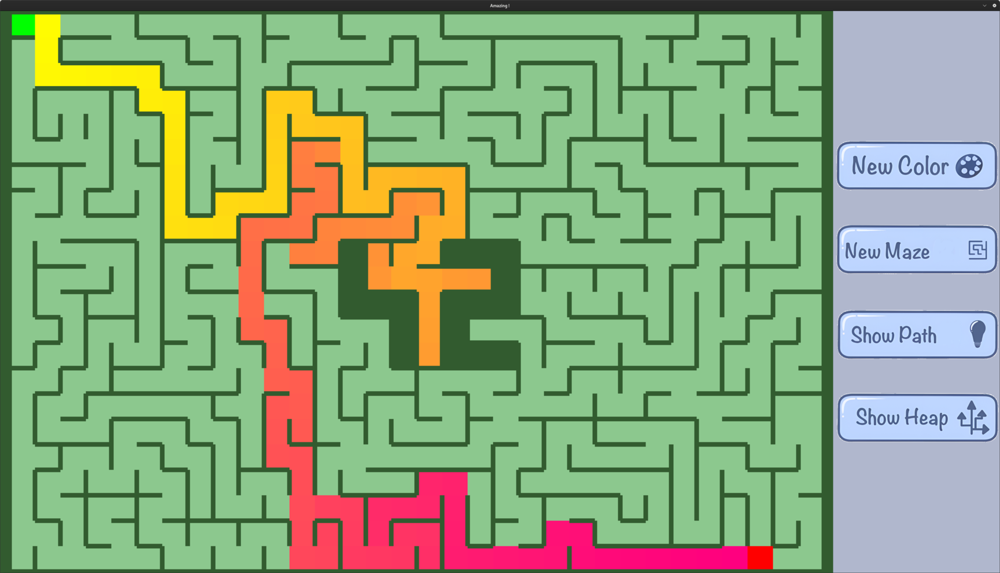

*This project has been created as part of the 42 curriculum by mboutte and pdauga.*

# A-Maze-Ing

## Result


## Description
A-Maze-Ing is a maze generator, solver, and visualizer built for the 42 curriculum. It generates mazes with an embedded """42""" logo, solves them with A*, and renders the result in an MLX window.

## Features
- Perfect or imperfect maze generation (randomized DFS + optional extra openings).
- A* solver that returns a directional path string.
- MLX visualizer with controls for new mazes, color refresh, and path/heap display.
- Deterministic generation via seed.

## Requirements
- Python 3.7+
- `Pillow` (for image scaling)
- MLX Python wheel (included): `lib/mlx-2.2-py3-none-any.whl`

Install dependencies Manualy:
```bash
pip install Pillow
pip install lib/mlx-2.2-py3-none-any.whl
```
### Note:
The program will install the dependencies by itself with make run or make build, and create a virtual environement.

## Instructions
Run the visualizer from the repo root:
```bash
make run
```

This will:
- Read your configuration.
- Generate a maze.
- Solve it.
- Write the maze + solution to `OUTPUT_FILE`.
- Open the MLX window.

## Configuration
Edit `config.txt` (keys are case-insensitive):
- `WIDTH` and `HEIGHT`: maze size (min 7x5 due to the 42 logo).
- `ENTRY`: start coordinates `x,y`.
- `EXIT`: end coordinates `x,y`.
- `OUTPUT_FILE`: output path.
- `PERFECT`: `True` or `False`.
- `SEED`: empty for random, or a fixed seed string for determinism.

Constraints:
- Entry and exit must be inside the grid and not on the """42""" logo cells.
- Entry and exit must be different.

## Output Format
The output file contains:
- Hex-encoded maze rows (one row per line).
- A blank line.
- The entry coordinates (`row,col`).
- The exit coordinates (`row,col`).
- The path string as a sequence of `N`, `E`, `S`, `W`.

Each cell is a 4-bit wall mask:
- `1`: North
- `2`: East
- `4`: South
- `8`: West

## Using The Generator In Python
```python
from mazegen import MazeGenerator

maze = MazeGenerator(width=25, height=25, perfect=True, seed_input="42").maze
```

## Tests
```bash
make test
```

## Contribution
- mboutte: A* solver, config parsing, maze generation.
- pdauga: MLX visualization, UI design.


## Resources
- Maze generation: https://en.wikipedia.org/wiki/Maze_generation_algorithm
- A* algorithm: https://en.wikipedia.org/wiki/A*_search_algorithm
- MLX documentation: https://harm-smits.github.io/42docs/libs/minilibx